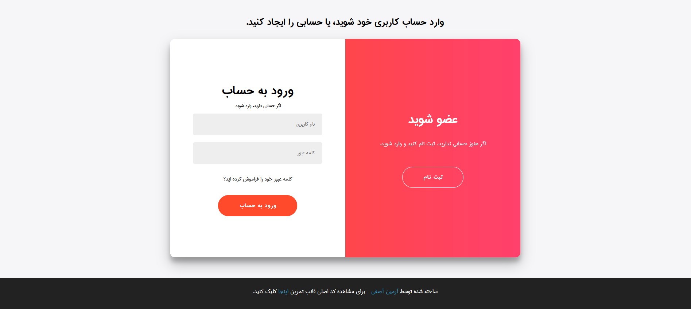
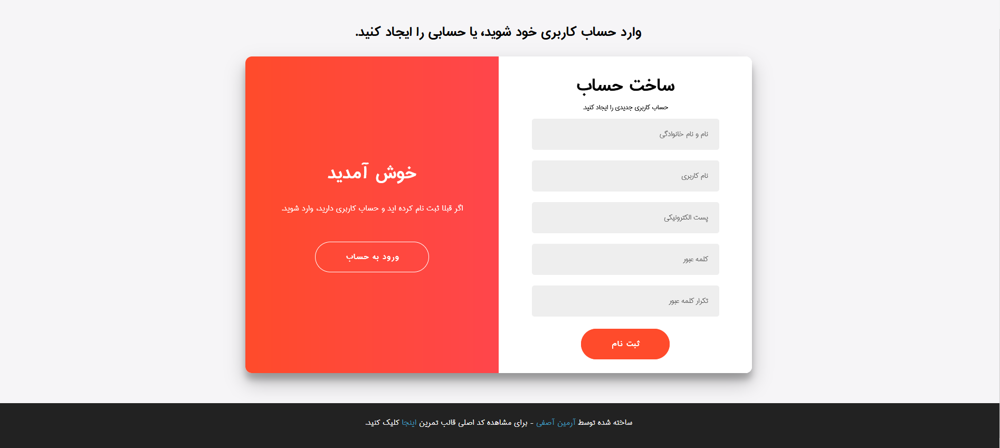
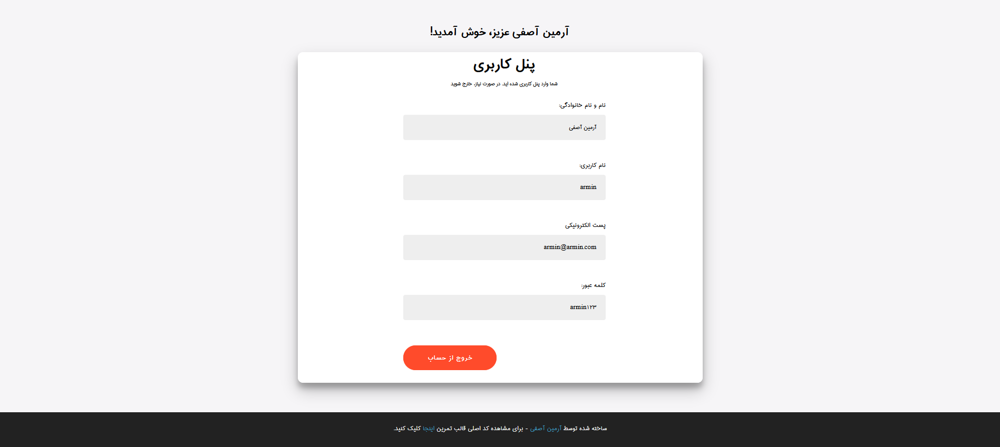

# User System
a super simple User System (sign in/out)

&nbsp;
<center></center>
&nbsp;
<center></center>
&nbsp;
<center></center>

&nbsp;
### Description
*User System* is a super simple accounting system that holds users data in a mongodb database and performs some simple actions like signin, signout, recover password. this project uses node-js as web platform and mongodb as database. it alsow uses several node packages like express, validaotr, body-parser and e.t.c.

&nbsp;
### How to install
first make sure you already installed node-js and mongodb(community) on your system.
```bash
git clone https://github.com/0xDeviI/UserSystem.git
cd UserSystem
npm i --save
node app.js
```

&nbsp;
### Features
- signin
- signout
- recover pass
- anti no-sql injection
- simple & safe for test purposes

&nbsp;
### How to use
You can run project using node or nodemon package:
```bash
node app.js
nodemon app.js
```
*Note: if you just installed Robo 3t on your machine, you can see users data visually and manage other mongodb databases.*
